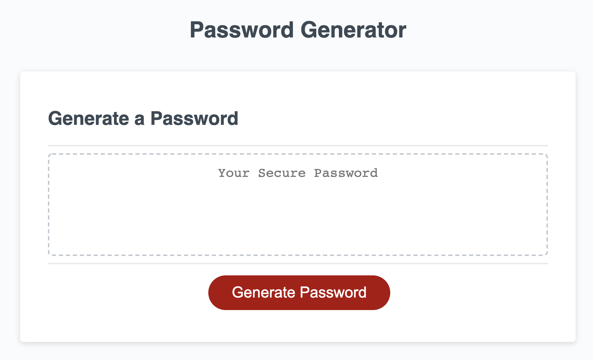
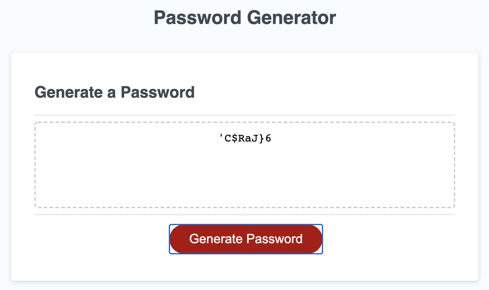

# Random Password Generator

## Purpose
Randomly generated passwords can provide greater security for sensitive data. Specific criteria for the password include having a length of 8-128 characters, lowercase, uppercase, numeric, and/or special character types, for each prompt to be validated after selection, and for the generated password that matches the selected criteria to be displayed on the page.

## Credits
Starter code retrieved from https://github.com/coding-boot-camp/friendly-parakeet. 

## Deployed Page 

[Deployed GitPage](https://damek-h.github.io/Random-Password-Generator/)
